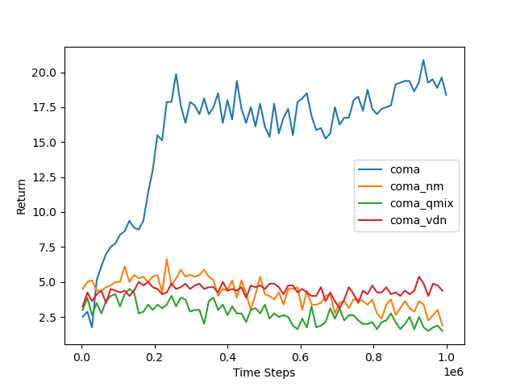

# COMA-SMAC
## Explorting Value Function Factorisation in COMA 
*Final Year Computer Science Project*   
Uses codebase from https://github.com/oxwhirl/pymarl  
 
*Training Multi-Agent systems to perform in cooperative environments.*  
Extending COMA by implementing value function factorisation that reintroduces decentralised learning. 

## Results
`predator_prey Task`  
 
  

we measuer results by taking the mean average of the return over 5 runs of each model. 
